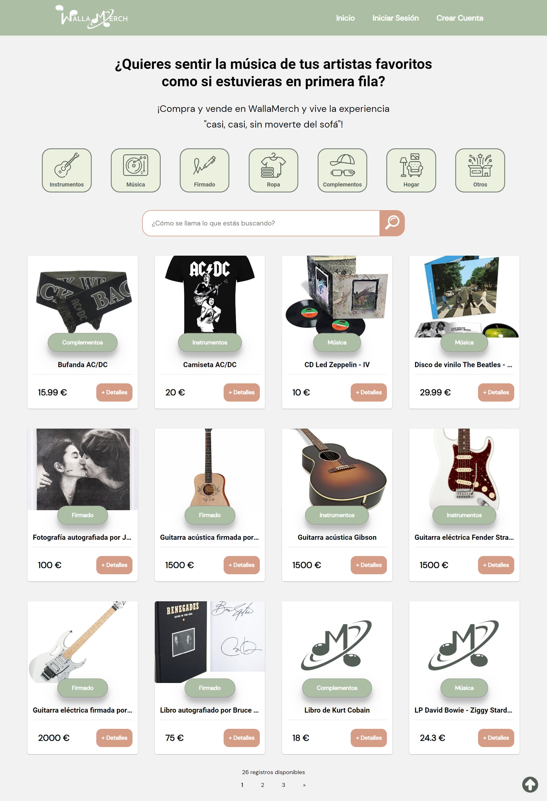
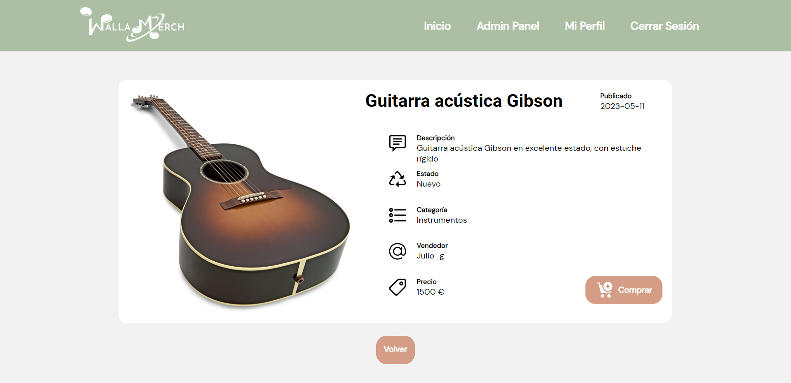
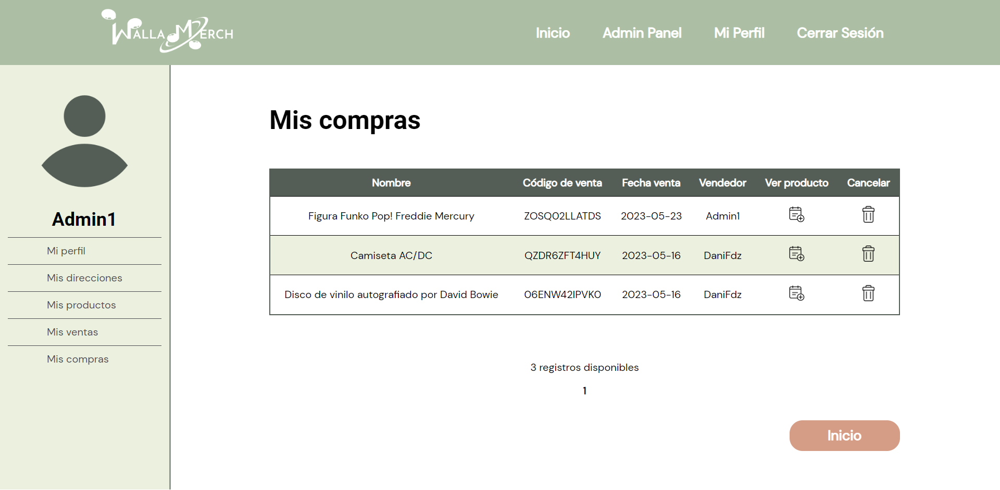
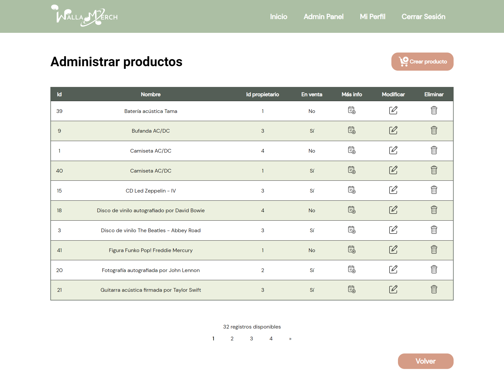
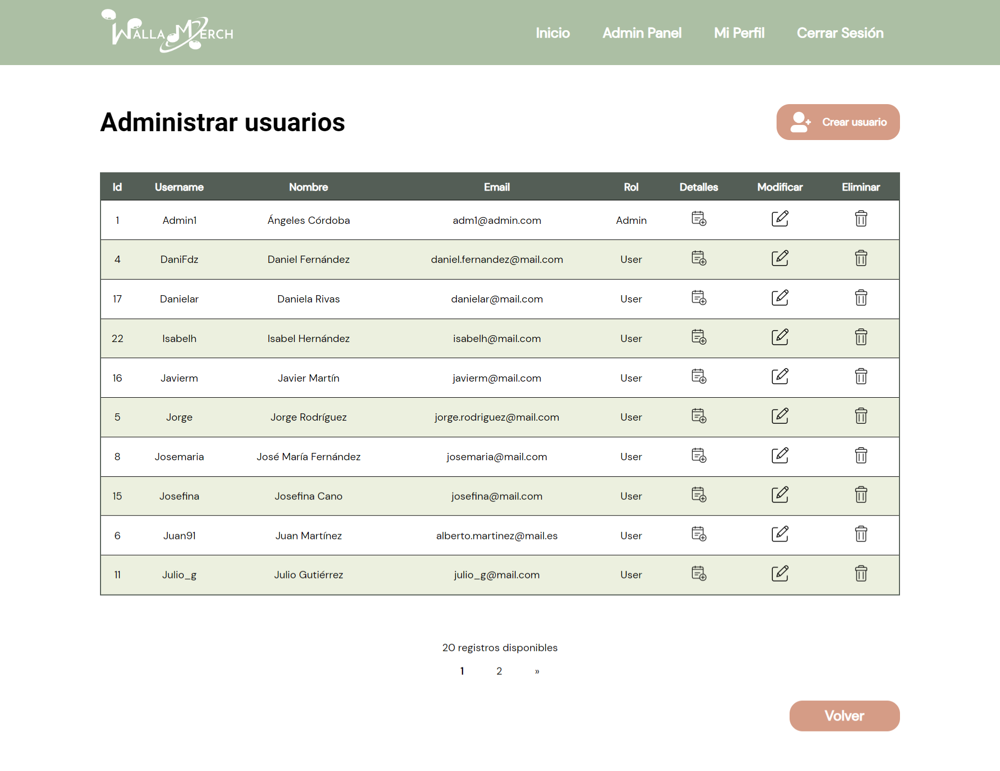
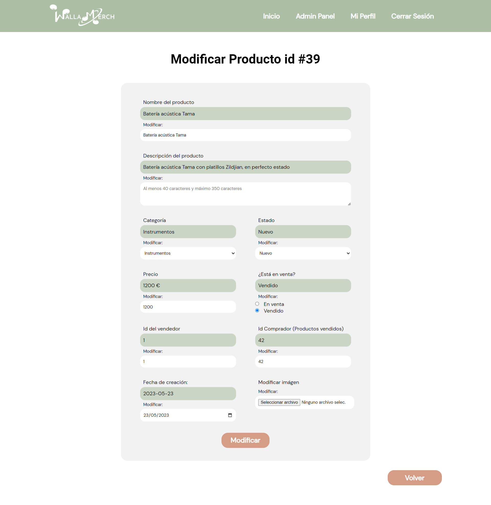

# Proyecto WallaMerch - Autora: Mª Ángeles Córdoba

## Demo del proyecto


!
[Log In](./images/login.png)






## Funcionalidades

El proyecto es un clon de la aplicación de Wallapop, basada en la compra-venta de productos, en este caso relacionados con 
música y merchandising. 
La aplicación consta de tres secciones o niveles:
  -	**Parte pública**. Usuarios anónimos, que no hayan iniciado sesión en la aplicación, podrán ver los productos disponibles 
  y sus detalles y tendrán la opción de iniciar sesión o crear una nueva cuenta de usuario. 
  -	**Parte para usuarios logeados**. Una vez que un usuario haya iniciado sesión, además de ver los productos disponibles, 
  tendrá acceso a un panel de gestión de su perfil, donde podrá ver y modificar sus datos personales o referentes a sus 
  productos, tantos los que tiene en venta como los productos comprados. Para acceder a la compra de un producto, es 
  necesario haber iniciado sesión. 
  -	**Parte para usuarios administradores**. Los usuarios con permisos de administrados podrán gestionar todos los productos 
  y usuarios de la web desde un panel de administrador.


## Puesta en marcha

Proyecto desarrollado en PHP y JavaScript.

Para iniciar el proyecto se necesita un servidor, en mi caso he usado Apache, una base de datos MySql y un intérprete de lenguaje PHP.
Para el desarrollo en local del proyecto, he usado XAMPP, que integra todas estas herramientas, y nos facilita su instalación.
Si usamos Apache como servidor, el archivo del proyecto debe estar ubicado en la carpeta **htdocs**.

Para iniciar el proyecto correctamente, es importante localizar el archivo **connect-db.php** (database/connect-db.php) y asegurarnos
de que los datos de conexión a la BBDD que tengamos en local coincidan con los del archivo, por lo que habrá
que cambiar el siguiente código por los datos que den acceso a nuestra BBDD:

```sh
    define ('SERVER', 'localhost');
    define ('USER', 'Your_User_Here');
    define ('PASS', 'Your_PassWord_Here');
    define ('DB', 'Your_DB_Here');
```

Para iniciar el proyecto, debemos en primer lugar iniciar nuestra base de datos, para ello está incluido el archivo **bbdd_proyecto.slq**,
para iniciarlo, simplemente hay que copiarlo en nuestro gestor de BBDD y ejecutarlo.

Una vez activados los servicios de Apache y de MySQL (desde el panel de control de XAMPP se pueden activar de forma sencilla),  
y realizadas las comprobaciones anteriores, podemos iniciar el proyecto en:

**http://localhost/wallamerch/** o http://localhost/_nombreFichero_/

Para acceder podemos, o bien crear un usuario nuevo, que no tendrá permisos de administrador, o usar unos de los usuarios que hemos creado al
ejecutar el archivo de inicio de la BBDDcomo:

USUARIO:
Username: user1@user.com
Password: 1234

ADMINISTRADOR
Username: adm1@admin.com
Password: 1234

Para poder usar la funcionalidad de pagar con la **API de pruebas de Paypal**, es necesario crear una cuenta en el entorno de pruebas de Paypal
(Link a la documentación: https://developer.paypal.com/tools/sandbox/). Una vez registrado, necesitamos la API Key asociada a nuestra cuenta
y añadirla en la **línea 67** del archivo **productos-comprar.php** (vistas/productos/productos-comprar.php), en data.clientId:

```sh
    data.clientId = "Your_API_Key_Here";
```

Una vez configurada la API Key, en nuestro dashboard del entorno de pruebas de Paypal encontraremos una serie de usuario y tarjetas de
prueba que podremos usar para realizar pagos en entorno de prueba.
